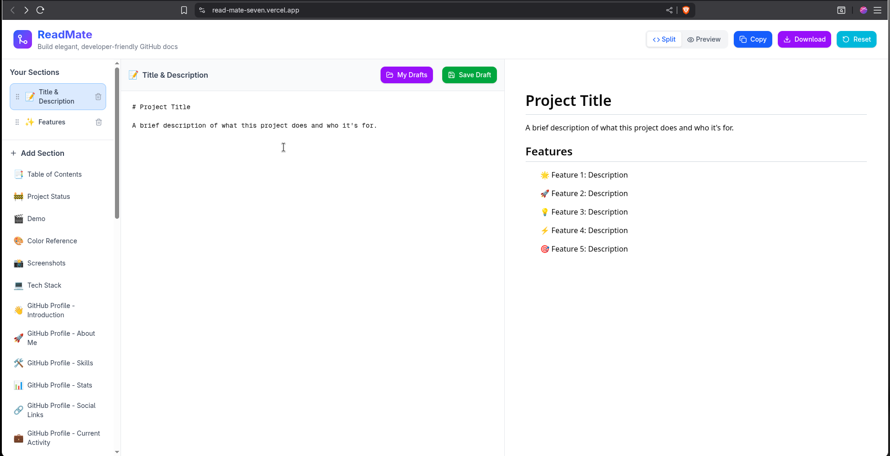
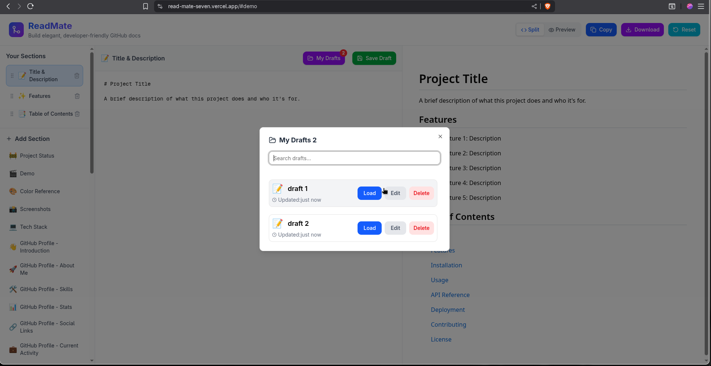

# 📝 README Builder

A modern, intuitive README generator that helps developers create professional documentation in minutes. Built with Next.js, TypeScript, and TailwindCSS.


## ✨ Features

- 🎨 **Modern UI/UX** - Clean, intuitive interface with split-view editing
- 📦 **40+ Templates** - Pre-built sections for every type of README
- 🎯 **Drag & Drop** - Reorder sections with visual drop indicators
- 👀 **Live Preview** - See changes in real-time with GitHub-style rendering
- 💾 **Local Draft System** - Save unlimited drafts in your browser
- 📥 **Export Options** - Copy to clipboard or download as README.md
- 🔍 **Search Drafts** - Quickly find your saved drafts
- 🌐 **Offline-First** - No database, no sign-up, works completely offline
- 🎭 **Session Restore** - Continue where you left off

## 🎬 Demo

**Live Page:** [https://read-mate-seven.vercel.app/](https://read-mate-seven.vercel.app/)

## 📸 Screenshots

### Main Editor View



### Draft Management



## 🚀 Getting Started

### Prerequisites

Node.js 18+ and npm/yarn/pnpm

### Installation

1. Clone the repository

```bash
git clone https://github.com/fadil-mx/ReadMate.git

```

2. Install dependencies

```bash
npm install
# or
yarn install
# or
pnpm install
```

3. Run the development server

```bash
npm run dev
# or
yarn dev
# or
pnpm dev
```

4. Open [http://localhost:3000](http://localhost:3000) in your browser

## 💻 Tech Stack

**Frontend:**

- [Next.js 14](https://nextjs.org/) - React framework
- [React 18](https://reactjs.org/) - UI library
- [TypeScript](https://www.typescriptlang.org/) - Type safety

**Styling:**

- [TailwindCSS](https://tailwindcss.com/) - Utility-first CSS
- [Shadcn/UI](https://ui.shadcn.com/) - Component library
- [Lucide React](https://lucide.dev/) - Icons

**State Management:**

- [Zustand](https://github.com/pmndrs/zustand) - Lightweight state management
- Zustand Persist - Local storage persistence

**Other:**

- Custom Markdown Parser - GitHub-flavored markdown

## 📖 Usage

### Basic Workflow

- 1. **Select Sections**: Choose from 40+ pre-built templates
- 2. **Edit Content**: Write your markdown in the editor
- 3. **Preview Live**: See changes instantly in GitHub style
- 4. **Reorder**: Drag sections to rearrange
- 5. **Save Draft**: Give it a name and save locally
- 6. **Export**: Copy or download your README.md

## 🗂️ Project Structure

```
readme-builder/
├── app/
│   ├── page.tsx              # Main application page
│   ├── layout.tsx            # Root layout
│   └── globals.css           # Global styles
├── components/
│   ├── Header
│   ├── markdown
│   ├── shared
├── hooks/
│   └── draft-hook.ts         # Zustand store
├── lib/
│   ├── utils.ts              # Helper functions
│   └── datas.ts              # Template data
|   └── validator.ts
└── public/
    └── ...                   # Static assets
```

## 🎯 Key Features Explained

### Local Draft System

All drafts are stored in browser localStorage using Zustand persist:

```typescript
// Structure
{
  id: 'draft-1234567890',
  name: 'My Project README',
  sections: [...],
  activeSection: 'title',
  createdAt: '2025-01-15T10:00:00Z',
  updatedAt: '2025-01-15T10:30:00Z'
}
```

## 🤝 Contributing

Contributions are always welcome! Please follow these steps:

1. Fork the repository
2. Create your feature branch (`git checkout -b feature/AmazingFeature`)
3. Commit your changes (`git commit -m 'Add some AmazingFeature'`)
4. Push to the branch (`git push origin feature/AmazingFeature`)
5. Open a Pull Request

Please read [CONTRIBUTING.md](CONTRIBUTING.md) for details on our code of conduct.

## 🗺️ Roadmap

- [x] Basic markdown editor
- [x] Section templates
- [x] Drag & drop reordering
- [x] Local draft system
- [x] Auto-save functionality
- [ ] local host AI for assistance
- [ ] Dark mode
- [ ] Export to multiple formats (PDF, HTML)
- [ ] Template customization
- [ ] Collaborative editing (optional cloud sync)
- [ ] Mobile responsive design improvements
- [ ] Import existing README files

## 💡 Lessons Learned

### Technical Challenges

**State Management Complexity**

- Managing multiple drafts with current draft tracking
- Implementing proper immutable state updates
- Handling edge cases (deleting current draft, etc.)

**Drag & Drop Implementation**

- Calculating precise drop positions (above/below)
- Visual feedback with drop indicators
- Maintaining stable IDs during reordering

**Auto-Save Strategy**

- Balancing frequency vs performance
- Debouncing to prevent excessive writes
- Distinguishing between creating new drafts and updating existing ones

### What I Learned

- Advanced React patterns (custom hooks, component composition)
- Zustand persist middleware for local storage
- HTML5 Drag & Drop API nuances
- TypeScript generics and type safety
- Browser storage limitations and optimization

## 📝 FAQ

#### Can I use this offline?

Yes! Everything runs in your browser. No internet connection needed after initial load.

#### Where are my drafts stored?

All drafts are stored in your browser's localStorage. They're private to your browser and device.

#### Is there a limit to how many drafts I can save?

Browser localStorage typically allows 5-10MB. You can save hundreds of READMEs before hitting limits.

#### Can I export to formats other than Markdown?

Currently only Markdown (.md) is supported. PDF and HTML export are planned.

#### Does this work on mobile?

The current version is optimized for desktop. Mobile improvements are on the roadmap.

## ⚖️ License

This project is licensed under the MIT License - see the [LICENSE](LICENSE) file for details.

## 👨‍💻 Author

**Your Name**

- GitHub: [@fadilmx](https://github.com/fadil-mx)
- LinkedIn: [fadil shereef](https://www.linkedin.com/in/fadil-shereef/)

## 💬 Support

If you like this project, please give it a ⭐️!

For support:

- Open an [issue](https://github.com/fadil-mx/ReadMate/issues)
- Email: fadilshereefmx@gmail.com

<div align="center">

**[⬆ back to top](#-readme-builder)**

</div>
